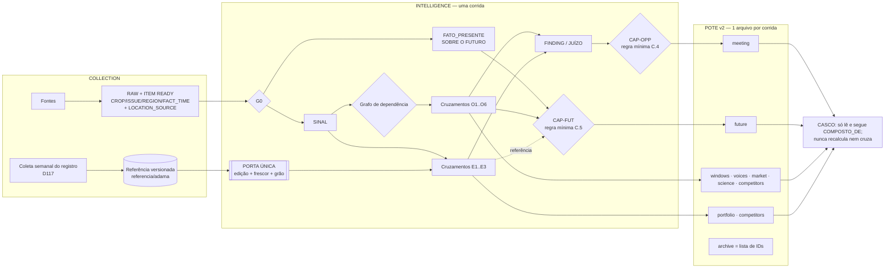

# PESQUISA-CRUZAMENTOS — como os cruzamentos devem chegar aos potes que o casco pega

SINTONIA LAB · Missão 04 · 27/09/2026 (estudo 18:00–18:55 BRT) · pedido do dono D118
Só leitura. Nada foi alterado em produção, na Sala, na coleta, na VPN, no portal ou nos repositórios.
Os únicos arquivos gravados ficam nesta pasta do LAB: PACOTE-CRUZAMENTOS.md, RASCUNHO-LAB-PRE-TRIANGULACAO.md, triangulacao/* e este relatório.

## Como ler as marcas de prova

- [M] = medido pelo LAB nesta sessão (git show, leitura de JSON ou HTTP anônimo).
- [H:doc] = relatório de outro agente, não medido de novo pelo LAB.
- [motor X] = afirmado por um dos três motores e não reaberto pelo LAB.
- NÃO SEI = não há prova.

## HEADs lidos

| referência | commit | data | o que é |
|---|---|---|---|
| produção (origin/servico-20260923-0923) | 18461b92 | 27/09 14:42 | contida no lote6 |
| lote6 (C:/g/l6) | 21cc06c0 | — | base da análise; lote6 − produção = 38 commits |
| portal no ar (origin/release/canonical) | 27b9e674 | 14/09 | — |
| claude/cruzamentos-max-sguy1x | 399e79f8 | — | — |
| claude/pote-v2-unico-contract-y8o1pi | 8982ce40 | — | — |
| claude/organize-collection-system-japwor | 0484e2dd | — | — |
| claude/casco-r7-publication-yb7nsg | 60ee56b2 | — | — |
| claude/single-reference-gateway-hhhj7t | c551062b | 27/09 18:42 | apareceu DURANTE o estudo; 46 commits à frente da produção, NÃO integrado |

## Alcance do estudo

- Lido: os ramos acima, a rodada R7 (fora do Git), o POTE-R7.json, o portal no ar (HTTP 200, 1 090 957 bytes) e as decisões do dono até D119.
- NÃO lido: a Sala, o ramo origin/nuvem/identidade-cruzamento-v1 (18:38; é o trabalho da D119 / MISSÃO-05) e os demais ~570 ramos remotos.

## Painel

| CHAVE | VALOR |
|---|---|
| TRIANGULACAO | COMPLETA |
| MOTORES_RESPONDERAM | 3/3 |
| STUDY_RUN_ID | STUDY-20260927T183246-6606bf |
| ACTUAL_MODEL | claude-opus-5-5/anthropic · gpt-6-sol/openai-codex · deepseek/deepseek-v4.1-flash/openrouter |
| Prova da triangulação | triangulacao/MANIFEST.json: 4 amarras, COUNTS=true nos 3, REJECT_REASONS vazio |
| PACOTE_SHA256 | 1376c15ff0f1d088986e980b75e20f84c18b20d2c2513846dd5dfe905978a683 |
| PROBLEMA_CENTRAL | NÃO falta cruzamento. A mesma pergunta («o rótulo ADAMA cobre esta cultura × este alvo na data?») é respondida por 8 lógicas diferentes, com 3 edições da referência e 3 regras de grão. Opportunity e Future recalculam cruzamentos por dentro, em cópia, sem apontar para eles. |
| DESCOBERTA_NOVA_1 | Já existe uma «porta única da referência» (ramo novo, 37 testes, 20/20 mutantes). Ela resolve a EDIÇÃO (D116/D117), mas NÃO o GRÃO: devolve «AUTORIZADO_NA_BULA_LIDA» também para os 518 usos que são só «espectro do produto» (DECLARACAO_DE_PRODUTO). |
| DESCOBERTA_NOVA_2 | O portal no ar ainda é o legado de 14/09. Mostra 43 oportunidades V2.1 (build 07/09), 2 delas «ACT_NOW» e «PUBLISHABLE» sem data de janela. Os 88 «portfolio matches» tiram a cultura do CATÁLOGO e o alvo da BULA (88/88), o que D116 e INT-LAW-144 proíbem. |
| DESCOBERTA_NOVA_3 | O pote `future` da R7 é uma agenda de eventos: 10/10 com cultura, praga e região = NÃO SEI; 7 documentos em 10 objetos. O julgamento ITFC (fora do repositório) já tem a forma que a lei pede para o Radar Futuro (gatilho, gatilho de invalidação, janela, «o que ainda não sabemos»). |
| BLOQUEIO_A_MONTANTE | A chave ISSUE_ID (praga/problema) não existe no contrato de campo da Collection (migration 033). Por isso CAP-WIN devolve NOT_POSSIBLE em todo item real (cap_win.py:386–388 [M]). Pela lei (CAP-OPP), sem essa chave não há oportunidade possível. |
| VEREDITO | PRONTO PARA PROPOR: (1) grão dentro da porta única; (2) composição por referência de ID no pote v2, com o esquema de ID a cargo da MISSÃO-05; (3) regras mínimas de OPORTUNIDADE e de FUTURO. TESTAR: o menor teste «uma verdade só». Nada disto é implementação. |

---------------------------------------------------------------------------------------------------

# A) INVENTÁRIO MEDIDO — onde hoje se faz cruzamento, oportunidade e futuro

Legenda da coluna REF:
- porta = lê pela porta única (ramo novo, não integrado);
- casa = lê referencia/adama/ direto do disco;
- cópia = lê outra cópia (IT-ROTULOS-PARES.json e/ou o CSV do cadastro);
- 0 = não lê referência.

## A.1 Motor atual (lote6 21cc06c0 ⊇ produção)

A1. `motor/corrida_da_inteligencia.py` — portão G0 [M]
- O que cruza: nada. É o portão de entrada.
- Chaves: `G0_EXIGE = (ITEM_ID, SOURCE_ID, FACT_TIME, RAW_OBSERVATION_ID)` (l.148). CROP, ISSUE e REGION NÃO estão no portão.
- Usos: `USOS_QUE_EXIGEM_TEMPO` (l.158) × `USOS_SEM_TEMPO` (l.169). O cruzamento «substância × rótulo» é uso SEM tempo.
- Item com FACT_TIME posterior à captura vira FACTO_PRESENTE_SOBRE_O_FUTURO (l.695). «NENHUM FINDING» (l.727).
- REF: 0.

A2. `motor/cap_win.py` — CAP-WIN, janela de cultura (830 l.) [M]
- O que cruza: campo × janela agronômica.
- Chaves: CROP_ID/ISSUE_ID/REGION_ID vindas de `JANELA_DECLARADA` (l.389).
- Na l.386–388 está escrito: «`PROBLEMA` NAO EXISTE no contrato 033 … todo item real sai NOT_POSSIBLE — que é a verdade de hoje».
- ACT_NOW exige 4 condições (l.703–718): janela aberta YES, temporal CURRENT, ≥2 redes independentes provadas, sem contradição.
- Saída: juízo CROP_WINDOW.
- REF: 0 na base. No ramo da porta ganhou `PRODUTOS_ADAMA` sem mexer no RESULT [H:PORTA-UNICA-REFERENCIA.md].

A3. `motor/capacidade_cientifica.py` — CAP-SCI (799 l.) [M]
- O que cruza: estudo × rótulo.
- Função: `ligar_ao_produto` (l.622).
- Estados próprios: NOT_POSSIBLE / UNKNOWN_REFERENCIA / UNKNOWN_MOLECULA / RELACAO_SEM_ROTULO / PARTIAL / CANDIDATE (l.622–634). Aqui PARTIAL significa «casa o rótulo, falta lugar ou período» (l.631–632).
- Compara cultura e alvo por igualdade exata. Tem ALIAS de molécula feito à mão.
- REF: casa (l.69, l.603), ou seja, a edição de usos de 24/08. Não distingue o nível de ligação no rótulo.

A4. `motor/motor_das_capacidades.py` — o motor (932 l.) [M]
- Junta CAP-WIN e CAP-SCI numa corrida só.
- Emite apenas SINAL / FATO_PRESENTE_SOBRE_O_FUTURO / RENDIMENTO_DE_FONTE (l.128–136). O juízo viaja como SINAL «porque o pote não tem ANALYTIC_JUDGMENT».
- Nunca emite OPORTUNIDADE nem FINDING.
- REF: indireta, via CAP-SCI.

A5. `motor/voce_dal_campo.py` — CAP-FIELD (944 l.)
- NÃO é chamado pelo motor, só por testes e provas [H: pacote §3.E].
- REF: 0.

A6. CAP-OPP e CAP-FUT: existem só como nome [M: busca no código]. A lei está escrita (Bíblia l.1731 e l.1781).

## A.2 Legado V2 / V2.1 (build de 02/09 e 07/09 — é o que está NO AR)

L1. `motor/v2_cruzamentos.py`
- Casava a cultura por palavra no texto livre.
- DESCARTADO pelo próprio sucessor: `v21_crossings.py:10–19` mediu 36 IDs de cultura errados e 7/19 casos sobre QA_UNREVIEWED [M].

L2. `motor/v21_crossings.py` — 19 cruzamentos, CLIENT_SAFE=false (l.202) [M]
- Chave: só CROP_ID.
- A invariante F («o par do rótulo contém a relação cultura × alvo») entra em INVARIANTS_PROVEN como constante escrita no código: `(['F'] if 'LABEL' in apoios else [])` (l.225). Nenhum código a testa. É o mesmo defeito que o arquivo denuncia na invariante C: «guarda que nunca dispara dá álibi» (l.107–113).
- Medido nos 14 cruzamentos campo × rótulo: em 11/14, o problema citado no boletim e o problema do rótulo NÃO têm nenhum ISSUE_ID em comum. Só uva (SCAPHOIDEUS), pera (SCAB) e tomate (POWDERY_MILDEW) coincidem.
- Os boletins ligam a mesma praga a 9–11 culturas do documento. Exemplo: IT-PHEN-010 tem 11 culturas, incluindo arroz, com ISSUE_SCAB. É o grão do documento sendo lido como ligação.
- REF: PRODUCT-RELATIONSHIPS V2.1, com LINK_STRENGTH (l.263/275).

L3. `motor/v21_oportunidades.py` (1 255 l.) [M]
- Estrutura: 6 arquétipos O1–O6, 8 portões A–H (l.261), red team (l.359). O «HOJE» está fixado em 02/09 (l.49).
- Resultado: 43 oportunidades, 33 CONFIRMED + 10 CANDIDATE.
- Recalcula os cruzamentos por dentro. 0 das 43 citam os IDs dos 19 cruzamentos [M em italy-handoff-v21.js].
- WINDOW_STATE = NOT_ESTABLISHED em 43/43 no handoff [M]. No snapshot servido (07/09) é UNKNOWN em 43/43, com WINDOW_DEFINED NO=27 e YES=16 [M].
- «ACT_NOW» nasce da IDADE do sinal ≤ 30 dias (l.792–794).
  - OPP_F8106D5E1767: SIGNAL_DATE 03/09 > REFERENCE_DATE 02/09, portanto SIGNAL_AGE_DAYS = −1. A idade negativa foi aceita.
  - No snapshot servido, as 2 ACT_NOW estão PUBLISHABLE, com WINDOW_START e WINDOW_END vazios.
- O5_REGULATORY_PREPARATION: 7 casos com ISSUE_IDS vazio em 7/7 [M].
- REF: índices de rótulo por cultura, recalculados.

L4. `leis/adama_relevance.py` — lei A–E «isto é oportunidade?» [M]
- CROP_FIT vem do CATÁLOGO (`DECLARED_ON_CATALOG_PAGE`, l.102). TARGET_FIT vem da BULA (`ON_MINISTERIAL_LABEL`, l.103). REGULATORY_FIT = `AUTHORIZATION_LIVE` (l.104).
- Medido no snapshot servido: 88/88 PORTFOLIO_MATCHES têm exatamente essa combinação. A cultura e o alvo nunca foram provados na MESMA linha da bula.
- Classificação: A=17, RADAR=21, SEGNALI=4, ERRORE=1 [H: pacote].
- SUPERFICIE (l.194): A → OPPORTUNITA.

L5. Radar Futuro «casa» (`italy-casa.js` RADAR_FUTURO l.15572; OPPORTUNITA_ATTUALI l.1536) [M]
- 45 ITFC; 44 renderizáveis; 0 ACT_NOW; 23 PREPARAR; 21 MONITORAR; 8 PORTFOLIO_LIMITED.
- Cada ITFC traz um cruzamento de portfólio embutido: MEDIDO_EXISTE 20, MEDIDO_ZERO 16, CEGO 3, DECLARADO_UNKNOWN 3, CONGELADA 2.
- O julgamento está congelado A MONTANTE, fora do repositório (`upstream/IT-FUTURO-HANDOFF-LINHA-B-V1.json`, SOURCE_HEAD 5855cad; AUDITORIA-DO-RADAR-FUTURO.md l.30–40: «DONO DO JULGAMENTO — congelado a montante, FORA deste repositório»).
- Cartão obrigatório: EVIDENCIA, FONTE, DATA, REGIAO, CULTURA_ALVO, JANELA, TRIGGER, INVALIDATION_TRIGGER, ESTADO, LIMITACOES, O_QUE_AINDA_NAO_SABEMOS.
- Portfólio «EVIDENCIA_CONGELADA · consulta viva PROIBIDA».
- NÃO passa pelo G0.

L6. `coleta/cruzar_regua_rotulo.py` (236 l.) — conversa × rótulo DENTRO da coleta
- REF: cópia (IT-ROTULOS-PARES.json, l.11/l.50) [M].
- A porta a lista como dívida [H].

## A.3 Experimentos de 27/09 (ramos e fora do Git)

X1. Piloto da sala `provas/o_piloto_da_sala.py` @2b4e095f [M]
- Função: `cruzar` (l.302).
- REF: casa (AUTHORIZED-USES, l.91 / l.245).
- NÃO está na base lote6 [H: porta].

X2. Rodada R7 `analise_r7.py` (316 l., fora do Git)
- 242 READY → 19 sinais; 86 cruzamentos «o rótulo ADAMA autoriza a substância citada na cultura do boletim?».
- As regras X3w (l.147) e X3h (l.154) foram criadas DEPOIS de ver os dados. O resultado mudou de 19 → 0 → 5, sem regressão [H:RELATORIO-RODADA-7.md].
- ENTITY_SOURCE 0/242 e LOCATION_SOURCE 0/242 [H].
- REF: casa (AUTHORIZED-USES).

X3. `motor/cruzamentos_max.py` @399e79f8 (1 128 l.) [M]
- Refaz os 86 com uma TABELA DE GRÃO provada pelo mesmo rótulo (l.364).
- Valida o registro na data contra o cadastro de 07/09 (l.170–174, l.498).
- PORTFOLIO_MATCH (l.816) e COMPETITIVE_SET (l.873), onde o grão é a SUBSTÂNCIA e cultura × alvo do concorrente = NÃO SEI.
- Resultado (CRUZAMENTOS-MAX.json):
  - 3 CONFIRMED_YES, 48 PARTIAL_GRAO_INCOMPATIVEL, 7 POSSIBLE_ANSWER_NO, 24 UNRESOLVED, 4 NOT_POSSIBLE;
  - PORTFOLIO 14 = 13 SEM_PAR_LIDO + 1 NAO_SEI;
  - saída para o pote: 103 CROSSING portfolio + 125 competitors.
- REF: cópia (PARES + CSV de 07/09).
- É a única lógica que usa o nível de ligação (LINK_LEVEL: 2 referências; DECLARACAO_DE_PRODUTO: 4).

X4. Pote v2, contrato único @8982ce40, `pacote/pote_intelligence_casco.py` (869 l.) [M]
- ESPECIES (l.87): SINAL, FUTURO, CROSSING, FINDING, OPORTUNIDADE, RENDIMENTO. `G0_FUTURO_POR_DESENHO = FACT_TIME:FUTURO_EM_RELACAO_A_CAPTURA` (l.95).
- Compartimentos:
  - meeting (l.120, «Radar delle Opportunità»): OPORTUNIDADE, CROSSING, FINDING, SINAL;
  - future (l.124): só FATO_PRESENTE_SOBRE_O_FUTURO;
  - portfolio (l.139);
  - archive (l.143), cujas VISTAS incluem «future».
- ARMADILHA DE NOME: `DA_V1` (l.162) mapeia a antiga vista «future» → archive, e «radarfuturo» → future. Duas coisas se chamam «future».
- Objeto (`_objeto`, l.387): OBJETO_ID, ESPECIE, CHAVES, PORQUE, CONTRADIZ, INCERTEZA, RESULTADO, PROVA (até o RAW), FORA_DO_CONTRATO (l.403), NAO_PARA_CLIENTE=True (l.393).
- NÃO há campo para um objeto analítico apontar para OUTRO objeto analítico (busca por DERIVED/COMPOSTO/DEPENDS = 0 [motor Opus; DeepSeek confirma]).

X5. POTE-R7.json real [M]
- 47 objetos = 25 objetos distintos + 22 projeções no archive. Mesmos OBJETO_ID; mudam só CHAVES, CHAVES_NAO_SEI, COMPARTIMENTO e FORA_DO_CONTRATO.
- meeting 0, com `PORQUE_VAZIO = SEM_OBJETOS_NESTA_CORRIDA`.
- future 10:
  - CROP, ISSUE e REGION = NAO SEI em 10/10; FACT_LOCATION com valor em 6/10 (Napoli, Teramo, Rimini, Abruzzo), mas REGION_ID = NAO SEI;
  - INCERTEZA = NAO SEI em 9/10;
  - 7 documentos distintos;
  - temas (pelas URLs): workshop de genética, dia mundial do desperdício, feiras, feira escolar Didacta, palestra «Cybermafie» da Polícia Postal.
- portfolio: 2 CROSSING com 4 das 5 chaves = NAO SEI (só ACTIVE_INGREDIENT_ID=TAUFLUVALINATE).
  - O conteúdo real viaja em FORA_DO_CONTRATO: CROSSING_STATE=PARTIAL_GRAO_INCOMPATIVEL e `PILOTO_CROSSING_ID = XC-IT-T3-008-0-TAUFLUVALINA`.
  - Ou seja, a referência a outro cruzamento já existe, mas por convenção num campo livre.
- CONTRADIZ = a string «NAO SEI» em 47/47 (não aponta para nenhum ID).
- 245 recusas: 199 PROVA_INCOMPLETA e 46 ITEM_BLOQUEADO_EM_G0 [motor DeepSeek].

X6. Porta única da referência @c551062b (NOVA, 18:42, não integrada) [M no código; resultados H:PORTA-UNICA-REFERENCIA.md]
- Arquivo: `motor/porta_da_referencia.py` (433 l.).
  - Frescor D117 (l.111), contando desde a ÚLTIMA CHECAGEM, como manda D117 §4.
  - Edição misturada = NÃO SEI inteira (l.151); carimbo com sha256 (l.208).
  - `autorizados(cultura, alvo)` (l.280): bula não lida = A_CONFIRMAR, nunca «não».
- Consumidores religados: CAP-SCI, motor, CAP-WIN, cruzamentos_max, concorrencia_meta, boletim_do_campo.
- Estado da referência: REGISTRO PROD_FTS_6_20260831, última checagem OK em 07/09. São 20 dias em 27/09 → PODE_ESTAR_DESATUALIZADO; vira «a confirmar» em 07/10.
- AUTHORIZED-USES agora traz LINK_LEVEL [M]: 886 LINHA_DA_TABELA, 626 BLOCO_DA_CULTURA, 518 DECLARACAO_DE_PRODUTO.
- LACUNA MEDIDA PELO LAB:
  - `_estado_do_uso` decide AUTORIZADO_NA_BULA_LIDA só pelo frescor, sem olhar LINK_LEVEL. Os 518 usos de «espectro do produto» saem com o mesmo estado dos 886 de linha de tabela.
  - Dos 6 consumidores, só o cruzamentos_max olha LINK_LEVEL. cap_win, CAP-SCI, boletim, concorrencia_meta e motor: 0 referências [M].
- Efeito declarado [H]: nos cruzamentos-max, 3 CONFIRMED_YES → POSSIBLE_ANSWER_YES_A_CONFIRMAR; portfolio 103 → 96; competitors 125 → 0.
- Dívida declarada [H]: cruzar_regua_rotulo, pesquisadores_t6, pacote_convergencia, data_clock, legado V2, voce_dal_campo e o portal (`italy-label-intelligence.js`, selado 31/08).

X7. Portal no ar [M]
- https://sintonia-eame-preview.vercel.app/portale devolve os mesmos bytes do release/canonical de 14/09 (sha e18781ba…).
- Carrega italy-handoff-v21.js, meeting-intelligence-snapshot.js (BUILD V21-ef6e7e5f37eaa6e6, 07/09; 43 casos; ACT_NOW 2; PUBLISHABLE 6) e italy-casa.js.
- SINTONIA_POTE: 0 ocorrências. O pote NÃO está no ar.
- O ramo casco-r7-publication (60ee56b2) tem SINTONIA_POTE 15×, mas não está publicado.

## A.4 Duplicações (a mesma pergunta respondida em lugares diferentes)

D-1. «O rótulo ADAMA cobre cultura × alvo (× substância) na data?» tem 8 respostas:
- CAP-SCI;
- piloto da sala;
- analise_r7;
- cruzamentos_max;
- v21_crossings/v21_oportunidades;
- leis/adama_relevance;
- ITFC (a montante);
- coleta/cruzar_regua_rotulo.

Viola INT-LAW-282 (Bíblia l.2020: «lógica repetida em duas tools = lógica sem dono»). A porta única reduz o problema a 6 consumidores numa porta, mas só no ramo novo e ainda sem o grão.

D-2. Três edições da referência convivem:
- 24/08 (usos que a CAP-SCI e a R7 leem);
- 31/08 (REGISTRATIONS CURRENT; a porta);
- 07/09 (CSV do cruzamentos_max).

As edições 14/09 e 21/09 existem só como fixture de teste [M].

D-3. Três vocabulários de estado para a mesma pergunta:
- CAP-SCI (PARTIAL = falta lugar/período);
- cruzamentos_max (PARTIAL = grão ≠ ligação);
- ITFC (MEDIDO_EXISTE/MEDIDO_ZERO/CEGO…);
- e mais V21 A–E e o contrato INT-LAW-142 (MATCH/CROP_ONLY/NOT_FOUND/UNKNOWN/MATERIAL_EXISTENTE_NAO_UTILIZAVEL).

D-4. Opportunity V2.1 e Future ITFC recalculam os cruzamentos por dentro, em cópia. Nenhum referencia um cruzamento por ID.

D-5. No POTE-R7, o archive repete 22 objetos. Quem somar gavetas conta 47, quando os objetos distintos são 25.

## A.5 Contradições com a Bíblia (Bíblia da Intelligence @21cc06c0)

| o que o código faz | o que a lei diz | onde |
|---|---|---|
| ACT_NOW por idade do sinal, e até com idade negativa | INT-LAW-104 (l.629): ACT_NOW exige janela compatível | v21_oportunidades.py:792–794 |
| Cultura do catálogo + alvo da bula = «match» | INT-LAW-144 (l.806): produto para cultura ≠ produto para alvo; D116 §1/§7: catálogo ≠ autorização | adama_relevance.py:102–104; 88/88 |
| Invariante F declarada sem teste | INT-LAW-040 (l.330): derivado aponta para inputs reais | v21_crossings.py:225 |
| Semelhança/grão do documento como ligação | INT-LAW-037 (l.304) e INT-LAW-091 (l.579): sem chave, NOT_POSSIBLE/UNKNOWN/PARTIAL; nunca «o mais parecido» | 48 PARTIAL; 11/14 sem alvo comum |
| Pote future = FATO_PRESENTE só por data, sem chave de domínio | CAP-FUT (l.1781–1802): OUTPUT FUTURE_SIGNAL com horizonte e incerteza; INT-LAW-133: data futura não é oportunidade nem radar | POTE-R7 future 10/10 |
| Nenhum objeto aponta para os seus pais | INT-LAW-233 (l.1059): DERIVED_FROM/DEPENDS_ON/PROMOTES_TO «conforme contratos futuros»; INT-LAW-273 (l.1708): cada seta com portão | pote v2 `_objeto` l.387 |
| Referência lida sem edição e sem frescor | D116 §3/§5 e D117 §4 | CAP-SCI (casa), R7, cruzamentos_max (cópia 07/09) |
| O juízo viaja como SINAL | INT-LAW-030 (l.256) e 036 (l.300): identidades distintas | motor_das_capacidades.py:128–136 |

Tensão de vocabulário [M]:
- FUTURE SIGNAL e ATTENTION ITEM aparecem em «INTELLIGENCE OWNS» (l.102), mas não na lista de não-compressão da INT-LAW-030 (l.256–272).
- FATO_PRESENTE_SOBRE_O_FUTURO existe na CAP-FUT (l.1800) e no código, mas não na INT-LAW-030.

---------------------------------------------------------------------------------------------------

# B) TAXONOMIA PROPOSTA DOS CRUZAMENTOS

Princípio (3/3 motores + LAB): não é uma família por tela. São TRÊS CLASSES, porque a lei trata cada uma de um jeito diferente.

CLASSE E — ESTRUTURAL (contra a REFERÊNCIA versionada: bula, registro, portfólio)
- Valida; nunca cria pressão de campo (INT-LAW-145) e nunca conta como fonte independente (INT-LAW-076).
- Tem UMA função só: a porta.

CLASSE O — OBSERVACIONAL (entre observações do mundo)
- Apoio, contradição e convergência. Passa ANTES pelo grafo de dependência (INT-LAW-070..079): mesmo texto em N lugares = 1 instituição.

CLASSE C — COMPOSIÇÃO (cruzamento de cruzamentos)
- Só por REFERÊNCIA a objetos das classes E e O, nunca recalculando.

## Regras que valem para todas as famílias

- Lugar só com LOCATION_SOURCE ∈ {TEXT, SECTION_HEADER} (D112). Senão, NÃO SEI.
- Tempo só com FACT_TIME e a sua base; nunca PUBLISHED_AT nem a idade do sinal.
- Sem a chave necessária: NOT_POSSIBLE / NÃO SEI / GRÃO_INCOMPATÍVEL; nunca o mais parecido (INT-LAW-091).
- Equivalência de nomes (ISSUE ↔ TARGET, «pomacee» ↔ maçã…) só por tabela explícita e versionada (INT-LAW-037). Referência possível: os códigos EPPO (ver D).
- Chaves de domínio: donas = Collection (INT-LAW-083/084). A Intelligence não as extrai do texto.
- Todo cruzamento de classe E carrega EDICAO_REGISTRO, ULTIMA_CHECAGEM, ESTADO_FRESCOR e sha256, pelo carimbo da porta (D116/D117).

## Estados honestos (um vocabulário só para o DONO ler)

Cada lógica atual traduz para estes estados. Mudar a taxonomia do contrato exige contrato (INT-LAW-142, l.799), então esta tabela é uma PROPOSTA de mapeamento, a decidir.

| estado para o dono | significado | INT-LAW-142 | cruzamentos_max | porta | CAP-SCI |
|---|---|---|---|---|---|
| SIM PROVADO | bula lida, cultura E alvo na MESMA linha ou bloco (LINK_LEVEL ∈ LINHA_DA_TABELA/BLOCO_DA_CULTURA), registro ativo na data do fato, frescor < 30 dias | MATCH | CONFIRMED_YES | AUTORIZADO_NA_BULA_LIDA só se LINK_LEVEL ≠ DECLARACAO | CANDIDATE com nível provado |
| SÓ CULTURA | produto para a cultura, alvo não provado | CROP_ONLY | — | — | — |
| A CONFIRMAR | bula ativa não lida; ou só «espectro do produto» (DECLARACAO_DE_PRODUTO); ou frescor ≥ 30 dias; ou validade na data não provada | UNKNOWN (com motivo) | POSSIBLE_ANSWER_YES_A_CONFIRMAR | A_CONFIRMAR | — |
| NÃO | bula lida por inteiro e o par não consta. NUNCA por bula não lida (D116 §7) | NOT_FOUND | POSSIBLE_ANSWER_NO (só depois de leitura completa) | — | RELACAO_SEM_ROTULO (só se lida) |
| GRÃO INCOMPATÍVEL | a fonte fala da cultura no nível do documento, não do trecho | UNKNOWN (motivo GRAO) | PARTIAL_GRAO_INCOMPATIVEL | — | — |
| NÃO SEI | referência ilegível ou ausente, cultura/alvo fora do vocabulário | UNKNOWN | UNRESOLVED | NAO SEI | UNKNOWN_REFERENCIA / UNKNOWN_MOLECULA |
| NÃO POSSÍVEL | falta chave factual | UNKNOWN (motivo SEM_CHAVE) | NOT_POSSIBLE | — | NOT_POSSIBLE |
| MATERIAL EXISTENTE NÃO UTILIZÁVEL | (INT-LAW-142, mantido) | MATERIAL_EXISTENTE_NAO_UTILIZAVEL | — | — | — |

## As famílias

### E1 · COBERTURA ADAMA — «a bula ADAMA cobre esta cultura × este alvo (× esta substância) na data do fato?»

- Absorve: «campo × rótulo», «ciência × rótulo», «voz × praga → produto» e «substância citada × rótulo» (R7 / cruzamentos_max). É SEMPRE a mesma função, chamada com as chaves que a fonte tem. Proibido virar família própria (a nona cópia).
- Chaves:
  - CROP_ID e TARGET_ID (vindo de ISSUE_ID por tabela explícita), [ACTIVE_INGREDIENT_ID];
  - PRODUCT_ID / REGISTRATION_NUMBER;
  - data do fato (validade na data);
  - EDICAO + ULTIMA_CHECAGEM + FRESCOR;
  - LINK_LEVEL e USE_ID (cultura e alvo do MESMO uso da bula).
- Estados: a tabela acima.
- Pote: portfolio («Portafoglio / Etichette»). No meeting e no future só por REFERÊNCIA.
- Hoje: 8 implementações (A.4 D-1); porta pronta em ramo, sem grão.

### E2 · CONCORRENTE × SUBSTÂNCIA / USO

- Chaves:
  - ACTIVE_INGREDIENT_ID;
  - produto do concorrente + registro válido na data;
  - cultura × alvo do concorrente só com a bula DELE.
- Estados: MESMA SUBSTÂNCIA (medível) / MESMO USO = NÃO SEI até ler bulas de terceiros. Nunca «o concorrente não cobre».
- Pote: competitors.
- Hoje: os registros de outras empresas não estão na referência. Pela porta, o resultado é 0 (lacuna 3 [H]).

### E3 · REGULATÓRIO × PORTFÓLIO

- (a) Evento: diff entre edições do registro (D116 §6: mudança comprovada = evento regulatório datado).
- (b) Data futura declarada no registro (validade), que é FATO_PRESENTE_SOBRE_O_FUTURO. É o próprio exemplo da Bíblia (CAP-FUT l.1800).
- Chaves: REGISTRATION_NUMBER, PRODUCT_ID, ACTIVE_INGREDIENT_ID, EDICAO_A × EDICAO_B, data declarada num CAMPO do registro (não em prosa).
- Estados: MUDOU (com data provada) / SEM MUDANÇA / EDIÇÃO NÃO LIDA / EDIÇÃO DIVERGENTE; validade: VENCE_EM <data> (declarado) / SEM DATA.
- Pote: portfolio (evento) + future (a data).
- Medido [M] no REGISTRATIONS de 31/08: 602 registros.
  - 101 registros ADAMA ativos têm validade até 27/09/2027. Três vencem em 30/09/2026 (CONTATTO 320, CONTATTO DOUBLE SC, SEEDRON).
  - 15 registros ativos já têm a data vencida, ou seja, DATA ≠ SAÍDA (prorrogações existem).
  - Conclusão: «vence em» é fato datado. «Vai sair do mercado» é NÃO SEI.
- Hoje: há só uma edição ingerida na referência. O diff depende da cadência D117 (terça-feira).

### O1 · CAMPO × JANELA (CAP-WIN)

- Chaves: CROP_ID, ISSUE_ID, REGION_ID (+LOCATION_SOURCE), FACT_TIME e a janela/fase DECLARADA pela fonte.
- O boletim regional já é, ele mesmo, um cruzamento oficial clima × disciplinar × fase (ver D). O Sintonia usa a janela declarada como FATO da fonte; não a recalcula.
- Estados:
  - ACT_NOW, só com as 4 condições (cap_win.py:703–718);
  - PREPARAR (abertura dentro de horizonte declarado);
  - MONITORAR;
  - NO_DEFENSIBLE_ACTION_YET;
  - NOT_POSSIBLE (+ pedido à Collection).
- Pote: windows.
- Hoje: bloqueado pela falta de ISSUE_ID no contrato 033 (cap_win.py:386–388).

### O2 · CLIMA × JANELA / DOENÇA

- Chaves: REGION_ID da estação (+LOCATION_SOURCE), CROP_ID, período de FACT_TIME e o MODELO DE RISCO CITADO com fonte (nunca inventado).
- Estados: FAVORÁVEL / DESFAVORÁVEL segundo o modelo X / NÃO SEI.
- Previsão ≠ observação.
- Pote: windows.
- Hoje: não há código na corrida. NÃO SEI se há dado agrometeorológico na Sala (não aberta).

### O3 · VOZ × PRAGA × CULTURA × LUGAR (CAP-FIELD)

- Chaves: CROP_ID, ISSUE_ID, REGION_ID (ENTITY_SOURCE e LOCATION_SOURCE, D112), FACT_TIME, AUTOR/CANAL (para a independência).
- Estados: RELATO ÚNICO / CONVERGENTE (≥ 2 originadores independentes) / NÃO SEI. Sem denominador, não há porcentagem.
- Pote: voices.
- Hoje: voce_dal_campo.py escrito e não chamado.

### O4 · CIÊNCIA × CAMPO

- Pergunta: o estudo trata do MESMO problema × cultura × região que o sinal de campo?
- Chaves: ISSUE_ID, CROP_ID, com ENTITY_SOURCE do estudo; a geografia do estudo só se escrita.
- Estados: APOIA / CONTRADIZ / NÃO COMPARÁVEL / NÃO SEI.
- Pote: science.
- Alimenta: O1 como contexto; C2 como sinal fraco.

### O5 · PREÇO × CULTURA (× tempo)

- Chaves: CROP_ID (ou mercadoria), mercado/lugar, período, UNIDADE e moeda.
- Estados: SERIE_MEDIDA (≥ 2 pontos na mesma unidade) / SINAL_SOLTO (o pote já tem esse campo).
- Um ponto não é série.
- Pote: market. Na convergência entra só como materialidade, nunca como gatilho (Bíblia l.1884).

### O6 · CONCORRENTE × CULTURA / JANELA (atividade comercial: anúncio, lançamento)

- Chaves: CROP_ID/ISSUE_ID que o CRIATIVO nomeia (ENTITY_SOURCE), FACT_TIME e lugar se escrito.
- Estados: ATIVIDADE OBSERVADA / NÃO SEI. Não prova demanda nem pressão.
- Pote: competitors (contexto; Mapa do dono §40: MARKET+COMPETITOR → contexto).

### C1 · CONVERGÊNCIA → OPORTUNIDADE (CAP-OPP)

- É o cruzamento de cruzamentos.
- Chaves: CROP_ID × ISSUE_ID × REGION_ID × TIME_WINDOW (Bíblia l.1741), aplicadas sobre objetos O1..O6 e E1.
- Estados: OPORTUNIDADE / NO_DEFENSIBLE_ACTION_YET (saída de primeira classe, INT-LAW-012).
- Pote: meeting.
- Regra mínima: em C.4.

### C2 · HORIZONTE → FUTURE_SIGNAL (CAP-FUT)

- Chaves: ISSUE_ID × GEO × HORIZON_WINDOW.
- Preserva: horizonte, impacto potencial, incerteza, indicadores que REFORÇAM e que ENFRAQUECEM. Equivale ao TRIGGER / INVALIDATION_TRIGGER que o ITFC já tem.
- Pote: future.
- Alimenta a CAP-OPP só como hipótese (l.1799).

### C3 · FUTURO × PORTFÓLIO

- Um objeto C2 ou E3(b) + REFERÊNCIA a um objeto E1. Nunca uma cópia embutida, como fazem hoje os ITFC «EVIDENCIA_CONGELADA».
- Pote: future.

## Correspondência com a lista da missão

| exemplo da missão | família |
|---|---|
| campo × rótulo | E1 (com chaves de O1/O3) |
| campo × janela | O1 |
| ciência × rótulo | E1 |
| concorrente × substância/alvo | E2 |
| voz × praga | O3 |
| preço × cultura | O5 |
| regulatório × portfólio | E3 |
| clima × janela | O2 |
| futuro × portfólio | C3 |

Acrescentadas pelo LAB: O4 (ciência × campo), O6 (concorrente × cultura/janela), C1 e C2.

---------------------------------------------------------------------------------------------------

# C) NÍVEIS E FLUXO ATÉ O POTE

## C.1 A escada (cada seta tem portão — INT-LAW-273, l.1708)

```text
N0   ITEM da Sala (READY; chaves da Collection)                     = a PROVA (até o RAW)
N0R  REFERÊNCIA versionada (bula/registro/portfólio pela PORTA)     = contexto; NUNCA pressão (INT-LAW-145)
N1   SINAL                 |  N1F FATO_PRESENTE_SOBRE_O_FUTURO     |  (N1W SINAL FRACO → vira C2)
N2   CRUZAMENTO (E* ou O*) = 2+ entradas + regra explícita + estado + motivo      COMPOSTO_DE → N1, N0R@edição
N3   FINDING / JUÍZO       = decisão com rastro + contradições                    COMPOSTO_DE → N2, N1
N4   OPORTUNIDADE | NO_DEFENSIBLE_ACTION_YET  (C1)                                COMPOSTO_DE → N3, N2
N4F  FUTURE_SIGNAL (C2) / FATO_PRESENTE_SOBRE_O_FUTURO com chave (E3b)           COMPOSTO_DE → N2, N1F
```

## C.2 Desenho do fluxo inteiro



Em texto:
- Collection entrega item + chaves.
- A Intelligence passa pelo G0 e separa SINAL e FATO FUTURO.
- Os cruzamentos O passam pelo grafo de dependência. Os cruzamentos E passam pela porta.
- Depois vêm os juízos, e em seguida CAP-OPP e CAP-FUT.
- Cada objeto cai UMA vez no pote, no seu compartimento. As vistas e o archive são projeções pelo mesmo OBJETO_ID.
- O casco lê.

## C.3 Os cruzamentos que VIVEM dentro de Opportunity/Future × os que os alimentam

O dono tem razão: Opportunity e Future JÁ contêm cruzamentos.
- As 43 V2.1 recalculam «rótulo por cultura» e janela por dentro.
- Os 44 ITFC embutem um julgamento de portfólio congelado.

O defeito não é haver cruzamento dentro do cartão. É ele ser uma CÓPIA sem identidade:
- 0 das 43 citam os 19 cruzamentos [M];
- o ITFC não é reproduzível (auditoria l.30–40);
- a auditoria já mediu o sintoma típico de cópia: «o cartão dizia 13 e mostrava 12» [motor Opus, AUDITORIA §6].

Decisão proposta (3/3 motores convergem; confere com PROV-O e com Palantir, ver D): COMPOR POR REFERÊNCIA DE ID, nunca por cópia.
- O cartão pode levar um RESUMO legível, desde que derivado dos pais e conferível.
- A verdade mora no objeto-pai.

Mudança MÍNIMA no pote v2 (candidata; não implementar):

1. Um campo `COMPOSTO_DE: [{OBJETO_ID, ESPECIE, PAPEL}]`.
   - PAPEL ∈ {APOIA, CONTRADIZ, VALIDA_ESTRUTURA, JANELA, HORIZONTE}. São as relações que a INT-LAW-233 já nomeia: SUPPORTS, CONTRADICTS, VALIDATES, DERIVED_FROM, DEPENDS_ON.
   - Obrigatório em FINDING, OPORTUNIDADE, FUTURE_SIGNAL e em todo CROSSING cuja entrada seja outro objeto.
   - O pote SÓ confere: o ID existe no MESMO arquivo; não há ciclo; se faltar pai, recusa com motivo SEM_PAI.
2. O CONTRADIZ passa a ser parte dessa lista (PAPEL=CONTRADIZ, com ID). Hoje é a string «NAO SEI» em 47/47.
3. A PROVA de cada objeto continua até o RAW, intocada. A PROVA do filho = união das PROVAs dos pais, calculada pelo pote, não escrita à mão.
4. Um campo `REFERENCIA_USADA` = o carimbo da porta (EDICAO, DATA_DA_EDICAO, ULTIMA_CHECAGEM_OK, ESTADO_FRESCOR, sha256). Obrigatório em todo cruzamento E*.
5. O que hoje vai para FORA_DO_CONTRATO e é estrutural (PILOTO_CROSSING_ID, CROSSING_STATE) sobe para campos do contrato.
6. O archive = lista de OBJETO_ID, não uma segunda projeção de chaves. A contagem na tela = objetos distintos (25, não 47).

LIMITE IMPORTANTE (D119, decisão do dono, 18:30):
- «Nenhuma equipe cria novo esquema de ID de cruzamento» até a MISSÃO-05 (identidade estável entre corridas) concluir.
- Por isso a referência proposta aqui vale DENTRO de um arquivo de pote (uma corrida), com INTELLIGENCE_RUN_ID. O ID leva a marca PROVISÓRIO.
- A pergunta «a mesma informação chega na corrida seguinte, como se junta ao cruzamento que já existe?» é da MISSÃO-05, não deste estudo.
- Medido: o mesmo URL + a mesma FACT_TIME geraram OBJETO_IDs diferentes no POTE-R7 [motor Opus].

Legado:
- Os portões A–H, o red team e os arquétipos O1–O6 do V2.1 viram ESPECIFICAÇÃO da CAP-OPP, não dados.
- Os 44 ITFC viram especificação da CAP-FUT: os campos do cartão deles já são os que a lei pede. Falta TRAZER O JULGAMENTO PARA DENTRO da corrida (hoje está congelado fora do repositório).

## C.4 Regra MÍNIMA para OPORTUNIDADE (meeting)

Todas as condições abaixo; faltou uma, a saída é NO_DEFENSIBLE_ACTION_YET, dita como resultado.

1. CROP_ID, ISSUE_ID, REGION_ID (LOCATION_SOURCE ∈ TEXT/SECTION_HEADER) e TIME_WINDOW derivada de FACT_TIME. Nenhuma em NÃO SEI (CAP-OPP JOIN_KEYS).
2. Pelo menos 1 observação de CAMPO (O1 ou O3). Estrutura sozinha nunca dispara (INT-LAW-145).
3. Convergência: ≥ 2 originadores independentes DEPOIS do grafo de dependência. As contagens EXTERNAL/INDEPENDENT/STRUCTURAL/FAMILY vão separadas (INT-LAW-077/092). A validação estrutural não conta (076).
4. Janela declarada pela fonte e compatível:
   - ACT_NOW só com as 4 condições da CAP-WIN (INT-LAW-104);
   - PREPARAR com abertura dentro de um horizonte declarado;
   - a idade do sinal nunca é janela;
   - idade negativa = erro.
5. E1 consultada (INT-LAW-142) pela porta, na edição carimbada.
   - «Solução ADAMA» só com SIM PROVADO.
   - Sem SIM PROVADO, o objeto fica como FINDING / ATTENTION ITEM, «problema sem solução ADAMA provada», e não entra no meeting como OPORTUNIDADE comercial.
   - Leitura mais cautelosa do LAB; o dono pode preferir um nível «CANDIDATA» visível.
6. Contradições ligadas por ID; COMPOSTO_DE completo até o RAW (LINEAGE COMPLETE; PARTIAL desqualifica).
7. Regras da corrida congeladas com hash ANTES de ver os dados. Regra nova → lote novo guardado à parte (lição X3w/X3h).

## C.5 Regra MÍNIMA para o FUTURO (Radar Futuro) — e o pote `future` está certo?

Resposta: CERTO como TRAVA, ERRADO como COBERTURA. Os 3 motores concordam, e o LAB mediu.
- Certo: separar o fato datado e garantir que nada futuro vira oportunidade (CAP-FUT MUST_NOT_DO, l.1800).
- Errado por dois motivos:
  - a saída que a lei pede (FUTURE_SIGNAL, l.1788) não tem vaga;
  - o critério de entrada é SÓ a data («FUTURO_EM_RELACAO_A_CAPTURA», l.95). Resultado: 10/10 sem cultura, praga ou região; feiras e uma palestra sobre cibercrime.

Regra mínima proposta:

a) FATO_PRESENTE_SOBRE_O_FUTURO entra no Radar só com:
   - FACT_TIME futura escrita na fonte (com base);
   - ≥ 1 chave de domínio PROVADA: CROP_ID, ISSUE_ID, ACTIVE_INGREDIENT_ID, PRODUCT_ID ou REGISTRATION_NUMBER;
   - deduplicação por documento.
   Sem chave de domínio, vai para o archive, não para o Radar. Nada é apagado.
   A primeira fonte determinística é a E3(b): validade declarada no registro.

b) FUTURE_SIGNAL (C2) só com:
   - ISSUE_ID × GEO × HORIZON_WINDOW;
   - incerteza declarada;
   - indicadores que reforçam E que enfraquecem (gatilho e gatilho de invalidação);
   - ≥ 2 camadas independentes de TIPOS diferentes. Contrato citado na auditoria, l.212–216: «Duas publicações não são duas camadas».
   Não é fato; chega ao meeting só como hipótese.

c) Espécie:
   - Opus e DeepSeek: espécie nova no pote.
   - GPT: subtipo de ANALYTIC_SIGNAL, porque a INT-LAW-030 não lista FUTURE_SIGNAL, embora l.102 o liste como dono da Intelligence.
   - O LAB prefere o mais econômico (subtipo), mas é DECISÃO do dono do contrato.

d) Nome: renomear a vista antiga «future» (que hoje mapeia para o archive, DA_V1 l.162), para acabar com duas coisas chamadas «future».

---------------------------------------------------------------------------------------------------

# D) LITERATURA E BENCHMARKS — só o que ajuda a decidir

Cada referência traz: o que é · o que resolve para o Sintonia · veredito.
[lido] = aberto pelo LAB; [motor] = citado por motor, não reaberto.

1. W3C PROV-O / PROV-DM — https://www.w3.org/TR/prov-o/ · https://www.w3.org/TR/prov-dm [motor Opus/DeepSeek/GPT]
   - O que é: modelo padrão de proveniência. `wasDerivedFrom` liga uma entidade a outra; o documento distingue «usou na atividade» de «derivou de».
   - Para o Sintonia: é exatamente o COMPOSTO_DE. Confirma que a derivação objeto → objeto é campo de primeira classe, não texto livre.
   - Veredito: PRONTO PARA PROPOR como MODELO CONCEITUAL (não como tecnologia RDF).

2. Palantir Foundry — link types — https://www.palantir.com/docs/foundry/object-link-types/link-types-overview [motor DeepSeek; URL confirmada pelo LAB na busca]
   - O que é: uma relação entre objetos é um TIPO declarado (cardinalidade, origem), não uma convenção.
   - Para o Sintonia: o PAPEL tipado no COMPOSTO_DE. O que NÃO transfere: a plataforma e a ontologia completa (exagero para 1 arquivo por corrida).
   - Veredito: OBSERVAR.

3. Nanopublications — https://nanopub.net/guidelines/working_draft/ [lido; working draft 23/09/2026]
   - O que é: cada afirmação é publicada em três partes separadas: a assertion, a proveniência da assertion e a informação da publicação.
   - Para o Sintonia: é a mesma separação que D112 exige (fonte × interpretação) e que o cruzamento precisa (o que a fonte disse × o que o sistema concluiu × quem/que versão concluiu).
   - Veredito: ESTUDAR, só como padrão de campos.

4. OpenLineage, modelo de objetos — https://openlineage.io/docs/spec/object-model [motor Opus]
   - O que é: cada execução declara as entradas e saídas.
   - Para o Sintonia: INTELLIGENCE_RUN_ID + REFERENCIA_USADA (edição) em cada objeto.
   - Veredito: OBSERVAR. Não adotar a ferramenta.

5. ODNI ICD 203, Analytic Standards — https://archive.dni.gov/files/documents/ICD/ICD-203.pdf [motor Opus, só o padrão 2; URL confirmada pelo LAB]
   - O que é: padrões de análise: exprimir a incerteza e separar informação de suposição e de juízo.
   - Para o Sintonia: INCERTEZA como campo do OBJETO (CAP-OPP: «nível A·B·C·D é parte do objeto, nunca do texto»). Separar SINAL/FINDING/OPORTUNIDADE.
   - Veredito: OBSERVAR (a Bíblia já incorpora).

6. EFSA — horizon scanning de pragas — https://www.efsa.europa.eu/en/topics/horizon-scanning-plant-pests [lido]
   - O que é: a EFSA varre notícias e publicações científicas com a ferramenta EIOS e pontua o risco de pragas emergentes com o PeMoScoring (15 critérios, desenvolvido com a ANSES). Publica um boletim MENSAL com as características de cada praga.
   - Para o Sintonia: um «radar do futuro» maduro é centrado em PRAGA (ISSUE) com critérios de risco explícitos, e não em eventos datados. Apoia a regra C.5(a)/(b): sem chave de praga, não é radar. Também é fonte candidata para a Collection.
   - Veredito: ESTUDAR (como fonte e como padrão de critérios).

7. Códigos EPPO — https://www.eppo.int/RESOURCES/eppo_databases/eppo_codes [lido]
   - O que é: sistema harmonizado de códigos para plantas e pragas (> 98 500 espécies em 06/2025), de download livre. Inclui códigos NÃO taxonômicos para GRUPOS de cultura, alvos e tratamentos.
   - Para o Sintonia: o problema de «pomacee» → maçã e «cucurbitacee» fundidas (cruzamentos_max l.24–32). Isso pede uma tabela de equivalência explícita; os grupos EPPO são a referência pública mais próxima para CROP_ID/TARGET_ID e para os grupos. (O Study IAB do LAB já tinha uma correção do GPT sobre EPPO.)
   - Veredito: TESTAR em pequeno: mapear os 28 grupos declarados nas bulas para códigos EPPO e medir quantos casam.

8. Boletins regionais de produção integrada (ex.: Emilia-Romagna) — https://agricoltura.regione.emilia-romagna.it/fitosanitario/difesa-sostenibile/bollettini [lido]
   - O que é: os boletins «sono redatti sulla base dei Disciplinari regionali di produzione integrata … e dei dati forniti dall'elaborazione dei modelli previsionali».
   - Para o Sintonia: o boletim JÁ é um cruzamento oficial (clima/modelo × disciplinar × fase). A família O1 deve usar a janela que o boletim DECLARA como fato da fonte, com a sua procedência, e não recalculá-la. Recalcular seria um segundo sistema e um risco de contradizer o órgão oficial.
   - Veredito: PRONTO PARA PROPOR (princípio de O1).

9. Plataforma IPM Decisions (UE Horizon 2020) — https://cordis.europa.eu/project/id/817617 · https://open-research-europe.ec.europa.eu/articles/5-320 [título e resumo]
   - O que é: plataforma pan-europeia que hospeda modelos de apoio à decisão (DSS) de manejo integrado.
   - Estudo sobre a adoção de DSS em pesticidas: https://open-research-europe.ec.europa.eu/articles/4-142 [lido: só cabeçalho; revisão por pares com ressalvas].
   - Para o Sintonia: a família O2 (clima × doença) deve CITAR um modelo publicado, nunca inventar um limiar.
   - Veredito: ESTUDAR, quando houver dado agrometeorológico medido na Sala.

10. Autorização nacional de produtos fitossanitários (Comissão Europeia) e banco do Ministero della Salute
    - https://food.ec.europa.eu/plants/pesticides/authorisation-plant-protection-products_en
    - https://www.salute.gov.it/new/it/banche-dati/banca-dati-dei-prodotti-fitosanitari
    - https://www.dati.salute.gov.it/it/dataset/fitosanitari
    - [motor GPT; não reabertos pelo LAB]
    - O que é: a autorização vale por país. A base europeia não substitui a nacional. O Ministero publica o cadastro e o último rótulo autorizado.
    - Para o Sintonia: confirma que E1 precisa da BULA nacional na edição certa. O catálogo e a base da UE não bastam.
    - Veredito: já coberto por D116/D117.

11. Sinais fracos (Ansoff 1975; Hiltunen: sinal × issue × interpretação) [motor DeepSeek, fontes secundárias; não reabertas]
    - Para o Sintonia: apoia que FUTURE_SIGNAL precisa de ISSUE e interpretação separados do fato.
    - Veredito: OBSERVAR (fonte secundária).

Descartado para agora: knowledge graph dedicado, GraphRAG, banco de grafos.
- Motivo: sem a chave ISSUE_ID em campo e sem identidade estável (D119), um grafo só guardaria melhor os mesmos NÃO SEI. É coerente com o BM-004 do LAB.

---------------------------------------------------------------------------------------------------

# E) RED TEAM — 10 formas de um cruzamento enganar o dono, e o teste que pega cada uma

1. SEMELHANÇA DE NOME vira ligação
   - Prova: v2_cruzamentos casava a cultura por palavra: 36 IDs errados (v21_crossings.py:10–19). O leitor funde «melone/zucchino/cocomero» → cucurbitáceas (cruzamentos_max l.24–32).
   - Teste: lint INT-LAW-037 (toda equivalência vem de tabela versionada, com linha citada) + controle negativo de pares parecidos que NÃO são iguais. Exigir 0 falsos «SIM».

2. GRÃO DO DOCUMENTO vira ligação da linha
   - Prova: 48/86 PARTIAL (o boletim lista 50 culturas no documento). Nos V2.1, 11/14 cruzamentos campo × rótulo sem nenhum alvo em comum; o mesmo ISSUE_SCAB ligado a até 11 culturas por boletim.
   - Teste: cultura e praga no MESMO trecho/seção (X3w-like, com hash antes). Mutação: juntar duas seções num texto só não pode criar SIM.

3. ESPECTRO DO PRODUTO vira uso na cultura
   - Prova: 518/2 030 usos = DECLARACAO_DE_PRODUTO. A porta devolve AUTORIZADO_NA_BULA_LIDA sem olhar LINK_LEVEL; 5 dos 6 consumidores não o leem.
   - Teste: lint «SIM PROVADO ∧ LINK_LEVEL = DECLARACAO_DE_PRODUTO» = 0. Rodar as 2 030 pela porta e contar.

4. CULTURA DO CATÁLOGO + ALVO DA BULA = par nunca lido junto
   - Prova: 88/88 PORTFOLIO_MATCHES do snapshot NO AR (CROP_FIT = DECLARED_ON_CATALOG_PAGE, TARGET_FIT = ON_MINISTERIAL_LABEL). Viola D116 §1/§7 e INT-LAW-144.
   - Teste: SIM exige cultura E alvo no MESMO USE_ID da bula. Mutação: apagar a cultura da bula mantendo-a no catálogo → o estado tem de cair.

5. EDIÇÃO VELHA ou SEM FRESCOR da bula/registro
   - Prova: três edições convivem (24/08, 31/08, 07/09). As edições 14/09 e 21/09 não foram ingeridas; a checagem tem 20 dias.
   - Teste: o teste E da porta (aos 30 dias nada sai afirmado) + um canário de diff entre edições (produto revogado na edição nova não pode sair SIM). Toda tela mostra edição e última checagem (D117 §4).

6. LUGAR DA FONTE vira lugar do fato
   - Prova: R7 com ENTITY_SOURCE 0/242 e LOCATION_SOURCE 0/242. No future da R7, FACT_LOCATION «Napoli/Teramo» é o lugar do EVENTO, com REGION_ID = NÃO SEI.
   - Teste: mutação «apagar LOCATION_SOURCE → NOT_POSSIBLE/NÃO SEI» + gold set humano D112 com lugar só em figura e título regional sem lugar no texto.

7. PUBLICAÇÃO ou IDADE vira janela («aja agora»)
   - Prova: v21_oportunidades.py:792–794 (ACT_NOW por idade ≤ 30); OPP_F8106D5E1767 com idade −1; as 2 ACT_NOW no ar sem WINDOW_START/END.
   - Teste: todo objeto em «agora» precisa de janela escrita na fonte (posição + sha256). Controle: sinal de 3 dias com janela já fechada → MONITORAR. Idade negativa → erro de corrida.

8. DATA FUTURA ou PREVISÃO vira radar ou fato
   - Prova: future R7 = 10/10 sem cultura/praga/região; palestra «Cybermafie» e feira escolar no «Radar Futuro». E3: 15 registros ativos com validade já vencida mostram que «data de validade» ≠ «vai sair».
   - Teste: item só com data futura e sem chave de domínio NÃO entra no Radar. «Vence em» é mostrado como fato datado; «sai do mercado» = NÃO SEI.

9. CONTAGEM DE INSTITUIÇÃO / REPUBLICAÇÃO vira «muitos confirmam»
   - Prova: future R7 com 10 objetos de 7 documentos. INT-LAW-071/078: mesma redação em N territórios = 1 instituição.
   - Teste: clonar 1 texto em 5 regiões → INDEPENDENT_SOURCE_COUNT = 1. A tela mostra redes independentes provadas, com as prováveis à parte (como a CAP-WIN já faz).

10. OBJETO CONTADO DUAS VEZES / CÓPIA QUE DIVERGE
    - Prova: POTE-R7 com 47 objetos = 25 distintos + 22 projeções no archive; a auditoria do Radar Futuro com «o cartão dizia 13 e mostrava 12»; 0/43 oportunidades apontam para o cruzamento.
    - Teste: total exibido = count(distinct OBJETO_ID); todo número de um cartão é recalculável a partir do COMPOSTO_DE; pai ausente → o pote recusa (SEM_PAI).

Extra (11), a mais traiçoeira porque parece prova: SELO DE INVARIANTE SEM TESTE
- Prova: a invariante F é marcada como «provada» por uma constante escrita no código (v21_crossings.py:225); as regras X3w/X3h foram criadas depois de ver os dados.
- Teste: mutação que viola F tem de reprovar. Regras congeladas com hash antes da corrida e aplicadas a um lote guardado à parte.

---------------------------------------------------------------------------------------------------

# F) RECOMENDAÇÃO — ordem de implementação, sem segundo sistema

O LAB não implementa; tudo abaixo é «pronto para propor». As decisões marcadas são do dono.

## F.1 O mínimo honesto para HOJE (D114: portal no ar hoje)

Nenhuma inteligência nova. Só escolher o que aparece e como aparece marcado.

1. Radar delle Opportunità (meeting)
   - Mostrar «0 oportunidades defensáveis nesta corrida», com o motivo (`PORQUE_VAZIO` já existe) e o caso oliveira × mosca como exemplo de NO_DEFENSIBLE_ACTION_YET.
   - NÃO mostrar as 43 V2.1 como oportunidade; em especial as 2 «ACT_NOW PUBLISHABLE» sem janela, uma delas com idade −1.
   - DECISÃO DO DONO: esconder o V2.1 ou mostrar com o selo «LEGADO 07/09 · sem janela provada».

2. Portafoglio
   - Só os cruzamentos que têm objeto no pote, com o estado literal, as chaves em NÃO SEI à vista e o carimbo da edição: «registro de 31/08, última checagem 07/09, PODE ESTAR DESATUALIZADO; a partir de 07/10 autorização a confirmar».
   - Nunca «autorizado» para uso de «espectro do produto».
   - Os «matches» do V2.1 (cultura tirada do catálogo) não aparecem como autorização.

3. Radar Futuro
   - Aplicar a chave de domínio (C.5a). Pelo medido, sobram 0 dos 10 da R7; a tela diz «nenhum fato futuro com cultura ou praga provada nesta corrida».
   - DECISÃO DO DONO: mostrar os 10 como «Agenda (eventos datados)» no archive, ou não mostrar.
   - Os 44 ITFC não passaram pela Intelligence (D97). DECISÃO DO DONO: esconder, ou mostrar com o selo «LEGADO — julgamento congelado fora do repositório».

4. Contagens: por objeto distinto (25), nunca pela soma das gavetas (47).

5. Janelas e ciência: o que o motor já emite, com a espécie real dita («juízo de janela», não «sinal»).

Observação: o portal NO AR ainda é o legado de 14/09, sem pote. Se a publicação do ramo casco-r7 não sair hoje, os pontos 1–4 valem para o legado que está no ar. As 2 «ACT_NOW» e os 88 «matches» são o risco maior de enganar hoje.

## F.2 Próximos passos, em ordem (o que destrava vem primeiro)

1. PORTA ÚNICA + GRÃO
   - A porta já existe (ramo single-reference-gateway, 37 testes, 20/20 mutantes).
   - Falta uma regra, num lugar só: `autorizados()` devolve SIM só com LINK_LEVEL ∈ {LINHA_DA_TABELA, BLOCO_DA_CULTURA}; DECLARACAO_DE_PRODUTO vira A_CONFIRMAR.
   - Religar a dívida declarada: cruzar_regua_rotulo, legado V2, piloto.
   - DECISÃO DO DONO: integrar a porta.

2. INGESTÃO DAS EDIÇÕES DO REGISTRO (D117, Collection)
   - Edições 14/09 e 21/09, depois toda terça-feira.
   - Destrava o frescor real, o diff (E3a) e o primeiro conteúdo honesto do Radar Futuro (E3b: validades declaradas).

3. COMPOSTO_DE + CONTRADIZ por ID + REFERENCIA_USADA no pote v2 (C.3)
   - Dentro de uma corrida; ID provisório até a MISSÃO-05 (D119).
   - DECISÃO DO DONO DO POTE: o contrato.

4. CHAVE ISSUE_ID (PROBLEMA) no contrato de campo da Collection (migration 033)
   - Sem ela, CAP-WIN, voz e CAP-OPP ficam em NOT_POSSIBLE (cap_win.py:386–388).
   - É trabalho da Collection, não da Intelligence.

5. CAP-OPP mínima como regra (C.4), composta por referência. O resultado normal esperado é NO_DEFENSIBLE_ACTION_YET, e isso é saída honesta.

6. CAP-FUT: trazer o julgamento ITFC para DENTRO da corrida (os campos do cartão já cumprem a lei) e abrir a espécie FUTURE_SIGNAL (C.5b/c).

7. Ligar voce_dal_campo.py (O3) — proposta do DeepSeek. Útil, mas depende do passo 4.

8. Gold set humano D112: 8–12 cruzamentos, formulário vazio, respondido pelo dono, antes de qualquer PASS de família.

## F.3 O menor teste (1 dia, fora do banco, sem LLM, sem custo de API) — «UMA VERDADE SÓ»

- Entrada:
  - os 86 pares da R7;
  - os 2 030 usos da referência;
  - os 88 matches do V2.1.
- Execução: rodar pela porta única (com e sem a regra de grão) e pelas lógicas atuais.
- Saídas medidas:
  - (a) quantos SIM se apoiam só em DECLARACAO_DE_PRODUTO;
  - (b) quantos matches do V2.1 caem quando cultura e alvo são exigidos no mesmo uso da bula;
  - (c) a tabela de divergências por par, com a causa: edição / grão / nível de ligação / vocabulário.
- Sucesso: 0 SIM com DECLARACAO_DE_PRODUTO depois da regra, e toda divergência explicada por motivo escrito.
- Falha: qualquer divergência sem causa. Nesse caso a porta não é «uma verdade só» e não se integra.

## F.4 RECOMENDAÇÃO EM 10 LINHAS

1. Uma pergunta, uma porta: a cobertura ADAMA só pela porta única; ninguém mais lê a bula.
2. Na porta, SIM só com cultura e alvo na mesma linha ou bloco da bula; espectro do produto = A CONFIRMAR.
3. Edição e última checagem no próprio cruzamento, sempre; aos 30 dias nada sai afirmado.
4. Três classes de cruzamento: estrutural (valida), observacional (converge), composição (cruzamento de cruzamentos).
5. Opportunity e Future apontam para os cruzamentos por ID (COMPOSTO_DE); nunca os recalculam.
6. Oportunidade = chaves completas + campo + 2 fontes independentes + janela da fonte + SIM provado + linhagem completa; senão NO_DEFENSIBLE_ACTION_YET.
7. Radar Futuro = fato datado COM chave agro, ou sinal com horizonte, incerteza e gatilhos; data sozinha é agenda.
8. Hoje: meeting vazio e explicado; Portafoglio só do pote e com a edição; V2.1 e ITFC escondidos ou com selo LEGADO (o dono decide).
9. Destravar a montante: ISSUE_ID no contrato de campo e edições semanais do registro.
10. Menor teste «uma verdade só» em 1 dia; nenhum PASS antes do gold set humano do dono.

---------------------------------------------------------------------------------------------------

# TRIANGULAÇÃO — confronto das três respostas cegas

## Convergências (3/3), conferidas com evidência medida

- O problema é a mesma pergunta respondida por várias lógicas (INT-LAW-282).
- Compor por referência de ID; o pote v2 não tem o campo.
- O pote future está certo como trava e errado como cobertura.
- ACT_NOW V2.1 por idade.
- Meeting vazio e explicado é o honesto de hoje.

Convergência não é prova. Cada ponto acima foi re-medido pelo LAB (seção A).

## Divergências e quem venceu (por medição, não por voto)

1. Próximo passo
   - Posições:
     - Opus: função única + teste dos 86;
     - GPT: teste adversarial da trilha inteira;
     - DeepSeek: ligar voce_dal_campo.
   - Medição nova: a função única JÁ EXISTE (porta, ramo de 18:42, depois do pacote); o que falta nela é o grão.
   - O voce_dal_campo não junta sem ISSUE_ID (cap_win.py:386–388).
   - Venceu: Opus, na direção, corrigido pelo LAB («fechar o grão na porta»). DeepSeek fica em 7.º.

2. Base da idade da referência (D117)
   - Opus contou a partir da edição: «usos de 24/08 = 34 dias → a confirmar».
   - D117 §4 diz textualmente «contagem desde a última CHECAGEM». A porta mede checagem em 07/09 = 20 dias → AVISO; «a confirmar» em 07/10.
   - Opus errou; corrigido.

3. Archive
   - DeepSeek: «já faz a coisa certa». Opus: «convida a contar duas vezes».
   - Medido: mesmos IDs; diferem só CHAVES, CHAVES_NAO_SEI, COMPARTIMENTO e FORA_DO_CONTRATO.
   - Os dois têm razão: a identidade está preservada, mas a tela precisa contar objetos distintos.

4. Espécie do futuro
   - Opus/DeepSeek: espécie nova. GPT: subtipo de sinal.
   - Bíblia: l.102 lista FUTURE SIGNAL, mas a INT-LAW-030 não.
   - Não se resolve por medição: é decisão de contrato. O LAB inclina-se pelo mais econômico (GPT).

5. «≥ 2 fontes» em toda oportunidade
   - GPT: só no ACT_NOW. Opus/DeepSeek: sempre.
   - CAP-OPP usa como portão a INT-LAW-077 (convergência exige independência) → ≥ 2 originadores.
   - Adotada a leitura mais cautelosa, com a nota.

6. ITFC
   - DeepSeek perguntou se os ITFC já têm horizonte e indicadores.
   - Medido: o cartão exige TRIGGER, INVALIDATION_TRIGGER, JANELA, CULTURA_ALVO e O_QUE_AINDA_NAO_SABEMOS.
   - DeepSeek estava certo em suspeitar: é «trazer para dentro», não «construir do zero».

7. Correções menores ao DeepSeek: G0_EXIGE está na l.148, não na l.146. Os «22 do archive» e as «245 recusas» foram conferidos em parte.

## O que NENHUM motor tinha (não estava no pacote)

- D119: o esquema de ID fica com a MISSÃO-05.
- A porta única de 18:42 e a lacuna de grão dentro dela.
- O portal no ar é o legado, com 2 ACT_NOW publicáveis.
- 88/88 matches com cultura do catálogo.
- 11/14 cruzamentos campo × rótulo sem alvo comum.
- 101 registros ativos com validade ≤ 12 meses e 15 ativos já «vencidos».

## Custo (§22)

| motor | chamadas | entrada | saída | outros tokens | custo | tempo |
|---|---|---|---|---|---|---|
| Opus 5.5 | 16 | 34 | 37 556 | cache 1 099 573 lidos / 101 827 escritos | assinatura (0 registrado) | 440 s |
| GPT-6 Sol | 10 | 85 871 | 8 879 | cache 535 936 | assinatura | 276 s |
| DeepSeek 4.1 Flash | 26 | 113 760 | 21 990 | cache 1 414 144 | ≈ US$ 0,0615 (estimado, OpenRouter) | 218 s |

- Sessão do LAB (medição, pacote, confronto, síntese): Opus, tokens NÃO SEI, ~55 min.
- Fontes lidas: ~40 arquivos em 8 refs + 1 portal HTTP + 7 páginas externas abertas + ~10 só por título.
- Descobertas úteis: 6 (porta sem grão; 88/88 catálogo; 11/14 sem alvo; portal = legado com ACT_NOW; ITFC ≈ CAP-FUT; 101 validades).
- Hipóteses descartadas: 4 (grafo/GraphRAG agora; voz como próximo passo; espécie futura sem chave; «NÃO» por bula não lida).

---------------------------------------------------------------------------------------------------

# ONDE POSSO ESTAR ERRADO

- A porta única e os seus números (6 religados, 37 testes, 103 → 96, 125 → 0) são [H] do relatório do ramo. Medi o código da porta e o LINK_LEVEL, não rodei os testes. O ramo pode mudar a qualquer momento.
- Não abri a Sala. A família O2 (clima) e a cobertura real de ISSUE_ID podem ser diferentes do que o código indica.
- Não li o ramo nuvem/identidade-cruzamento-v1 (MISSÃO-05). Se ele já definir referências entre objetos, parte de C.3 fica redundante (e ainda bem).
- A regra «sem SIM PROVADO não é oportunidade comercial» é a leitura mais cautelosa. Com ela o meeting pode ficar vazio por muito tempo, e o dono pode preferir ver «candidatas» marcadas.
- «101 registros vencem em ≤ 12 meses» é contagem sobre a edição de 31/08 (20 dias sem checagem). Prorrogações existem (15 ativos já vencidos), então nada disso é previsão de saída de mercado.
- 11/14 «sem alvo comum» usa os ISSUE_IDs gravados no legado. Se aqueles IDs estiverem errados (e o próprio V2 teve 36 culturas erradas), o número é sintoma, não medida agronômica.
- As referências externas foram lidas em parte e valem como analogia, não como prova de adequação ao Sintonia.
- Posso ter subestimado o custo operacional do COMPOSTO_DE para o casco. Não medi o casco do ramo casco-r7.

---------------------------------------------------------------------------------------------------

# GATE D109 — CONTENT_CLASSIFICATION

KNOW_HOW = YES · ITALIAN_AGRO_BRAIN = NO · BIBLE_CHANGE = NO · HANDOFF_ONLY = NO

- KNOW_HOW (candidatos; o LAB não escreve):
  - a mesma pergunta em 8 lógicas;
  - a porta resolve edição mas não grão;
  - invariante declarada sem teste (v21 l.225);
  - ACT_NOW por idade (e idade negativa);
  - cultura do catálogo + alvo da bula;
  - pote future só por data vira agenda;
  - archive soma em dobro;
  - D117 conta desde a checagem.
- ITALIAN_AGRO_BRAIN: nada. As validades de registro são REFERÊNCIA (D116 §2: o Brain aponta, não copia); nenhum fato agronômico foi provado.
- BIBLE_CHANGE: nenhuma decidida. Candidatas:
  - (1) COMPOSTO_DE / relações tipadas (INT-LAW-233);
  - (2) regra mínima de OPORTUNIDADE (C.4) e de FUTURO (C.5);
  - (3) estado SIM exige LINK_LEVEL de linha ou bloco;
  - (4) espécie ou subtipo FUTURE_SIGNAL;
  - (5) mapeamento de estados honestos (INT-LAW-142 exige contrato).
- HANDOFF (estado transitório):
  - portal no ar = legado 14/09;
  - porta não integrada;
  - edições 14/09 e 21/09 não ingeridas;
  - checagem da referência vira «a confirmar» em 07/10;
  - ESTADO-DO-LAB.json e CUSTO.md NÃO atualizados neste turno (pendente, por causa do HARD STOP).

---------------------------------------------------------------------------------------------------

# EM PALAVRAS SIMPLES

«Cruzamento» é juntar duas informações que falam da mesma coisa: mesma cultura, mesma praga, mesmo lugar e mesmo momento. Por exemplo: «o boletim diz que há mosca na oliveira» junto com «a bula de um produto ADAMA autoriza usar contra mosca na oliveira».

O que encontrei:

1. Não falta cruzamento; sobra. A pergunta «a ADAMA tem produto autorizado para isso?» é respondida por 8 pedaços diferentes do sistema, cada um do seu jeito e com datas diferentes da lista oficial. Hoje à tarde outra equipe criou uma «porta única» para todos perguntarem no mesmo lugar, e isso está certo. Mas essa porta ainda trata igual duas coisas diferentes: «a bula diz que serve para esta praga nesta cultura» e «a bula diz, de modo geral, que o produto serve para essa praga». Uma em cada quatro linhas é do segundo tipo.

2. As «oportunidades» e o «radar do futuro» antigos fazem cruzamentos por dentro, copiados, sem dizer de onde vieram. O certo é cada oportunidade APONTAR para os cruzamentos que a sustentam, como uma nota de rodapé em que se clica e se chega ao documento original. Para isso falta um único campo no pote.

3. O portal que está no ar hoje ainda é o antigo. Ele mostra duas oportunidades como «aja agora» só porque a notícia era recente, sem nenhuma data de janela, e uma delas com data «do futuro» (−1 dia). Também dá «match» de produto juntando a cultura tirada do catálogo com a praga tirada da bula, e isso nunca foi provado junto.

4. O «Radar Futuro» novo aceita qualquer coisa com data futura. Por isso hoje só tem feiras, um dia mundial e uma palestra sobre crime na internet, nenhuma com cultura ou praga. O Radar Futuro antigo (ITFC) tem o formato certo, mas foi julgado fora do sistema e não pode ser refeito.

5. Há uma trava lá atrás: o formulário da coleta ainda não tem o campo «qual praga/problema». Sem ele, pela própria regra do Sintonia, nenhuma oportunidade pode ser montada.

O que dá para fazer hoje, sem inventar nada:
- mostrar «zero oportunidades defensáveis» com a explicação;
- mostrar só os cruzamentos que passaram pela Intelligence, com a data da lista oficial e o aviso «pode estar desatualizada»;
- tirar do Radar Futuro o que não fala de cultura ou praga;
- esconder o antigo, ou mostrá-lo com o selo «antigo».

Próximo passo: ajustar a porta única para só dizer «sim» quando a bula liga a praga à cultura na mesma linha, e rodar os 86 casos que já temos para ver onde as respostas antigas discordam. É um dia de trabalho no computador, sem custo de IA.

Decisões que são suas:
- (a) esconder ou marcar como «antigo» as 43 oportunidades e os 44 cartões de futuro antigos;
- (b) aceitar uma tela de oportunidades que por enquanto vai dizer muitas vezes «ainda não há ação defensável»;
- (c) integrar a porta única;
- (d) o que fazer com os 10 eventos datados: agenda ou nada.

Os três motores de IA responderam (3/3). Onde discordaram, decidi pela medição, não por votação.

HARD STOP — estudo entregue. Nada foi implementado nem alterado fora da pasta do LAB.
